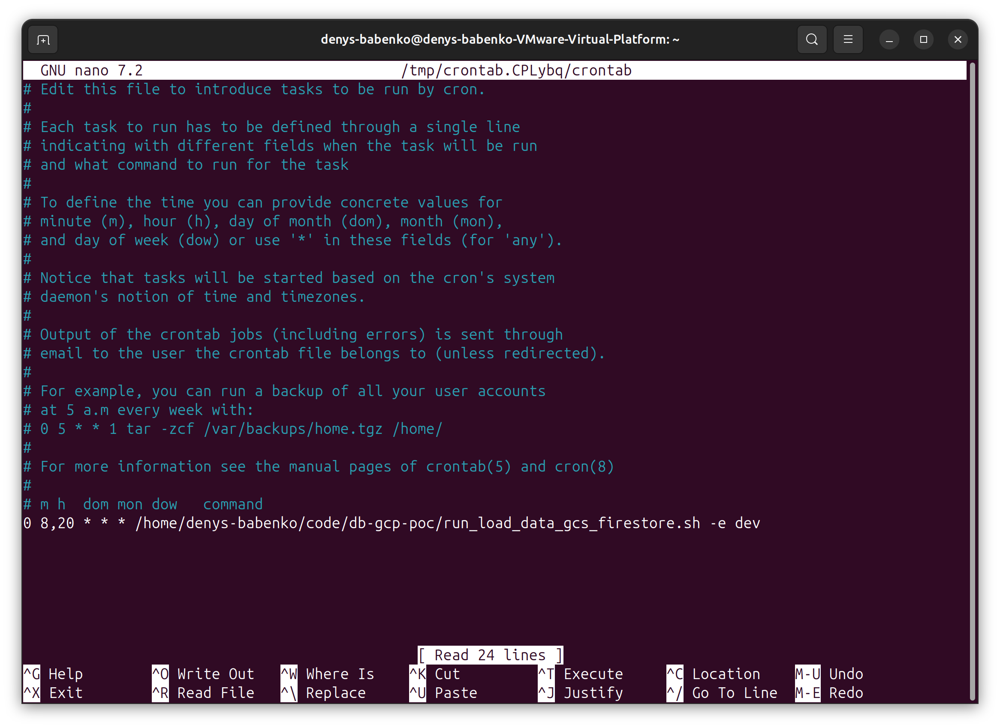

## Task
Let’s assume that this script needs to be run automatically twice a day. Please design
 the script so that it will be run twice a day at 8 am and 8pm.

    a. How can we check if it is running?
    b. If the terminal session disconnects while a script
    is running will it stop the script?
    c. How can we ensure the script will run regardless
    if the terminal session is connected?

## Solution:

We can use crontab for scheduling of script execution
To edit crontab:

```
crontab -e
```

Add row 
```
0 8 * * * /path/to/run_load_data_gcs_firestore.sh -e dev
```



>> a. How can we check if it is running?

With `crontab -l` you can verify that job is scheduled

Command `ps aux` report current processes

```bash
ps aux | grep run_load_data_gcs_firestore.sh
```


>> If the terminal session disconnects while a script is running will it stop the script?
>> How can we ensure the script will run regardless if the terminal session is connected?

No, terminal disconnection will not stop the script.

If script executed by cron it runs as a background process managed by cron daemon.

It is not affected by terminal session.
